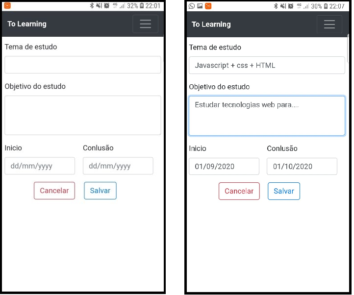

# **To Learning App**

- Nome: Lauro Milagres Oliveira
- Disciplina: Tópicos Especiais em Sistemas de Informação: Aplicações Híbridas

Simples PWA para criar rotina de estudos em um período de tempo e analisar o progresso nos conteúdos adiconados a lista.

## Telas

###### Tela inicial
- Tela inicial onde será mostrado os conteúdos de estudos no periodo de aprendizado do usuário. O usuário pode finalizar, editar, criar ou apagar tarefa.

###### Tela de cadastro e edição
- O usuário registra novo conteúdo de estudo ou edição de um já criado.

###### Tela de progresso
- O usuário pode acompanhar o status dos estudos, acompanhando seu rendimento e pode gerar relatório.

## Dados armazenados pela aplicação

O aplicativo não necessita de permissão para acesso, os dados são armazenados localmente pela aplicação.
Portanto não sendo necessário dados pessoais do usuário, apenas armazena as listas de estudos (tema, observação, data de inicio e data de conclusão).

## Observações

Legenda:
- [x] SIM
- [ ] NÃO

Caso você responda "não" a qualquer uma dessas questões, justifique o porquê.

- [ ] A aplicação é original e não uma cópia da aplicação de um colega ou de uma aplicação já existente?
- [x] A aplicação tem pelo menos duas interfaces (telas ou páginas) independentes?
- [x] A aplicação armazena e usa de forma relevante dados complexos do usuário?
- [x] A aplicação possui um manifesto para instalação no dispositivo do usuário?
- [x] A aplicação possui um service worker que permite o funcionamento off-line?
- [x] O código da minha aplicação possui comentários explicando cada operação?
- [x] A aplicação está funcionando corretamente?
- [ ] A aplicação está completa?

Justificativas:

1. A aplicação é original e não uma cópia da aplicação de um colega ou de uma aplicação já existente?
    - Não é cópia, e também não é original,pois é similar a um TO-DO list. A ideia é o usuário estudar e acompanhar o progresso nos conteúdos.
2. A aplicação está completa?
    - Não, a aplicação contém mais funcionalidades, inclusive na forma de definir o cronograma de estudos. Inicialmente era para ser desenvolvido com uso de alguma Framework (Ionic ou React), mas para fins didáticos, foi definido pelo professor o desenvolvimento de uma PWA do projeto sem uso de framework, e devido ao prazo foi desenvolvido um esboço.

## Links
[GitHub](https://github.com/LauroM/PWA).
[Repl.it](https://repl.it/@LauroM1/PWA).
[LinkedIn](https://www.linkedin.com/in/lauro-milagres-38030b167/).